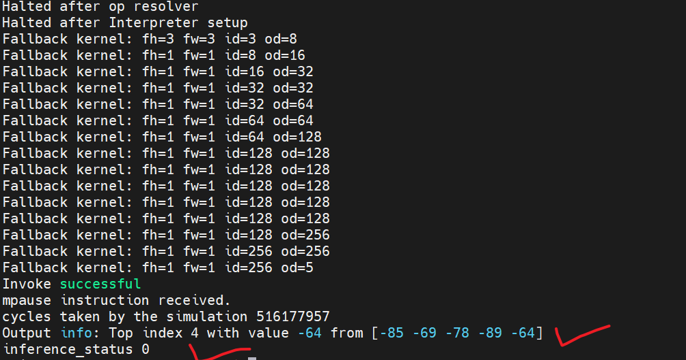

# NPUSim MobileNet(AI模型) 教程

本教程讲解 `npusim_run_mobilenet.py` 如何使用 CoralNPU 的 Python 仿真器绑定（bindings）来执行已编译的 C++ 二进制程序 `run_full_mobilenet_v1.cc`，以及二者如何交互的内部机理和机制。

## 概述

仿真一个像 MobileNet 这样的 TFLite Micro 模型通常需要两个组件：
1. **主机端 Python 脚本（`npusim_run_mobilenet.py`）**：控制 NPU 仿真器、注入输入、运行仿真并提取输出。
2. **设备端 C++ 二进制（`run_full_mobilenet_v1.cc`）**：该 C++ 代码**搭建 TFLM 解释器以运行推理**。使用 `coralnpu_v2_binary` Bazel 规则构建该 target，会将其打包成可在仿真的 CoralNPU 上运行的可执行文件。

## 1. C++ 设备端代码（`run_full_mobilenet_v1.cc`）

C++ 代码负责实际的推理流水线。为了与 Python 主机通信，它**将特定的内存缓冲区暴露为全局变量**。

### 内存段与符号
我们使用 GCC 的 `__attribute__` pragma，将全局数组放置在特定的内存段（`.data` 和 `.extdata`）中：
```cpp
extern "C" {
// The tensor arena for TFLite Micro working memory
constexpr size_t kTensorArenaSize = 4 * 1024 * 1024; // 4MB
uint8_t tensor_arena[kTensorArenaSize] __attribute__((section(".extdata"), aligned(16)));

// Buffers the Python script will read/write
int8_t inference_status = -1;
uint8_t inference_input[224 * 224 * 3] __attribute__((section(".data"), aligned(16)));
int8_t inference_output[5] __attribute__((section(".data"), aligned(16)));
}
```
将它们放在 `extern "C"` 内部，可以防止 C++ 名称改编（name mangling），使 Python 脚本能够通过名称（例如 `"inference_input"`）在编译后的 ELF 二进制中轻松查找它们的地址。

### 推理执行
在 `main()` 内部，脚本使用 `memcpy` 在暴露的符号与内部 TFLM 解释器张量之间架起桥梁：
1. **输入**：`memcpy` 将数据从 `inference_input`（由 Python 填充）复制到 TFLM 的输入张量。
2. **调用（Invoke）**：解释器运行模型。
3. **输出**：`memcpy` 将数据从 TFLM 的输出张量复制到 `inference_output`（Python 将从这里读取）。

> [!NOTE]
> `printf` 通过 HTIF（Host Target Interface）的半主机（semihosting）机制支持，这会带来一些额外开销并在仿真期间影响性能。建议在完整性能剖析（profiling）期间限制输出。

## 2. Python 主机脚本（`npusim_run_mobilenet.py`）

该 Python 脚本使用 `CoralNPUV2Simulator` 来启动 ELF 二进制，并通过内存操作与 C++ 符号交互。

### 仿真器初始化与 ELF 加载
```python
npu_sim = CoralNPUV2Simulator(highmem_ld=True, exit_on_ebreak=True)
r = runfiles.Create()
elf_file = r.Rlocation('coralnpu_hw/tests/npusim_examples/run_full_mobilenet_v1_binary.elf')
```
脚本使用 Bazel 的 `runfiles` 工具来定位编译后的 `.elf` 二进制，而不受主机环境影响。

### 符号解析
为了与 C++ 符号通信，Python 必须找到它们各自的内存地址：
```python
entry_point, symbol_map = npu_sim.get_elf_entry_and_symbol(
    elf_file,
    ['inference_status', 'inference_input', 'inference_output']
)
```
`get_elf_entry_and_symbol` 解析 ELF 文件，返回一个字典（`symbol_map`），将诸如 `'inference_input'` 这样的字符串映射到它们内部的 32 位 RISC-V 内存地址。

### 注入输入
在启动仿真器之前，脚本填充输入缓冲区：
```python
if symbol_map.get('inference_input'):
    input_data = np.random.randint(-128, 127, size=(224 * 224 * 3,), dtype=np.int8)
    npu_sim.write_memory(symbol_map['inference_input'], input_data)
```
这会直接覆写仿真器内存空间中 `inference_input` 指针处的字节。

> TODO：为什么输入数据是随机数据？不应该是用来推理的数据吗

### 执行与提取
```python
npu_sim.run()
npu_sim.wait()
```
仿真器一直运行，直到 C++ 应用退出或命中断点。

完成后，主机脚本直接从内存读取输出数组：
```python
if symbol_map.get('inference_output'):
    output_data = npu_sim.read_memory(symbol_map['inference_output'], 5)
    output_data = np.array(output_data, dtype=np.int8)
```
最后，使用 `npu_sim.read_memory` 检查最终的 `inference_status` 值，以确保执行成功。

## 如何运行
要用更新后的 Python 脚本运行仿真，从仓库根目录运行该 Bazel target：
```bash
bazel run tests/npusim_examples:npusim_run_mobilenet
```




## 内部流程小结

1. **编译（Compile）**：`run_full_mobilenet_v1.cc` 产生一个 `.elf` 文件，其中包含位于静态内存地址、未经改编的符号。
2. **定位（Locate）**：Python 的 `npusim` 解析该 `.elf`，找到 `inference_input` 和 `inference_output` 的精确地址。
3. **写入（Write）**：Python 将模拟的输入数据写入 `inference_input` 地址指针处。
4. **运行（Run）**：Python 调用仿真器。C++ 代码将 `inference_input` 复制给模型、计算、再将结果复制到 `inference_output`。
5. **读取（Read）**：仿真结束。Python 读取 `inference_output` 地址指针处的内容以验证结果。


## 总结

这个实际上，是单纯测试软件的方法。这边调用npusim是一个纯软件的模型，和自己的coral rtl模型无关。是为了快速验证AI算法的。 

两大类:ISS(功能模型)vs RTL 仿真(硬件模型)

|                    | **ISS(指令集模拟器)**                         | **RTL 仿真**                               |
| :----------------- | :-------------------------------------------- | :----------------------------------------- |
| 代表               | **npusim**(MPACT)                             | cocotb / 独立 Verilator / UVM              |
| 模拟的是           | **指令的"行为"**(每条指令对寄存器/内存做什么) | **真实硬件**(门、寄存器、总线),逐周期      |
| 有没有 RTL/Verilog | ❌ 没有,纯软件功能模型                         | ✅ 就是 Chisel→SV 那套真硬件                |
| 回答的问题         | "我的**程序/模型**算得对不对?"                | "我的**硬件**行为对不对、几个周期?"        |
| 速度               | **快**(整个 MobileNet 几秒)                   | **慢**(同样的 MobileNet 跑 RTL 可能几小时) |
| 周期/时序信息      | ❌ 没有                                        | ✅ 有                                       |

**一句话:ISS 像 NPU 的 QEMU**——它"懂"每条 CoralNPU 指令该干什么,但它不是硬件;RTL 仿真是"把芯片蓝图在软件里逐周期跑起来"。

目前，该项目总共有以下验证方法：

| 方式                   | 类别         | 目标 / 驱动                              | 你跑过吗              |
| :--------------------- | :----------- | :--------------------------------------- | :-------------------- |
| **npusim**(MPACT)      | ISS 功能模型 | `//tests/npusim_examples:...`(py_binary) | 正在看                |
| **cocotb + Verilator** | RTL 仿真     | `//tests/cocotb/...`,Python testbench    | ✅(20/20、tutorial)    |
| **独立 Verilator sim** | RTL 仿真     | `//tests/verilator_sim:...`,C++ 命令行   | ✅(semihosting printf) |
| **UVM + VCS**          | RTL 仿真     | `tests/uvm/`,商业仿真器                  | ❌(没 VCS)             |

1. **ISS(npusim)用于软件侧**：开发/调试你的 **ML 模型和程序**、统计指令数、快速验证算法对不对。RTL 太慢,你不会拿它跑整个 MobileNet,但 ISS 几秒就跑完。
2. **RTL 仿真用于硬件侧**：验证你将来要综合/流片的**真实硬件**有没有 bug。
