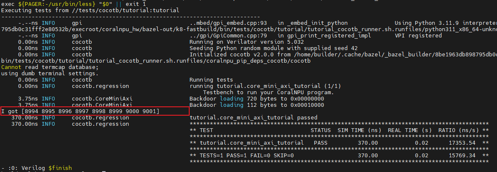

# 编写一个 CoralNPU 程序

本教程介绍编写 CoralNPU 程序的基础知识。你将：

1) 了解 CoralNPU 程序的基本结构。
2) 编写并编译一个基础程序。
3) 用 cocotb 测试台（test bench）测试你的程序。

## 前置条件

本教程假设你已经完成 opensecura 的[入门指南](https://opensecura.googlesource.com/docs/+/refs/heads/master/GettingStarted.md)。

## 编写一个基础的 CoralNPU 程序

打开 [`tests/cocotb/tutorial/program.cc`](../../tests/cocotb/tutorial/program.cc)，这是一个骨架程序：

```c++
// TODO: Add two inputs buffers of 8 uint32_t's (input1_buffer, input2_buffer)
// TODO: Add one output buffer of 8 uint32_t's (output_buffer)

int main(int argc, char** argv) {
  // TODO: Add code to element wise add/subtract from input1_buffer and
  // input2_buffer and store the result to output_buffer.

  return 0;
}
```

一个典型的 CoralNPU 程序结构包括：

1) 输入缓冲区，用于存放你想执行的计算的输入。
   在本教程中，我们假设**主机核（host core）会在程序执行前把数据写入 CoralNPU 的 DTCM。**
2) 输出缓冲区，供 CoralNPU 存放计算结果。与输入缓冲区类似，我们假设 **CoralNPU 会写入其 DTCM 中的某个位置，供主处理器在程序完成后读取**。
3) 要执行的实际计算。

### 定义输入和输出缓冲区

本教程中，我们接受两个输入缓冲区并输出一个缓冲区，每个由 8 个 uint32_t 组成。我们在 `main` 之外定义它们。
`__attribute__((section(".data")))` 定义缓冲区存放在 data 段中。

```c++
uint32_t input1_buffer[8] __attribute__((section(".data")));
uint32_t input2_buffer[8] __attribute__((section(".data")));
uint32_t output_buffer[8] __attribute__((section(".data")));

int main(int argc, char** argv) {
  // TODO: Add code to element wise add/subtract from input1_buffer and
  // input2_buffer and store the result to output_buffer.

  return 0;
}
```

在本教程中，**我们不需要定义这些缓冲区的精确位置**。我们的链接脚本会把它们分配在 DTCM 中，并在测试台中查询它们的位置。

> 因为后续cocotb中会有办法得到`input1_buffer`的地址。

### 定义计算

作为一个简单示例，我们把 `input1_buffer` 与 `input2_buffer` 中的元素逐元素相加：

```c++
uint32_t input1_buffer[8] __attribute__((section(".data")));
uint32_t input2_buffer[8] __attribute__((section(".data")));
uint32_t output_buffer[8] __attribute__((section(".data")));

int main(int argc, char** argv) {
  for (int i = 0; i < 8; i++) {
    output_buffer[i] = input1_buffer[i] + input2_buffer[i];
  }
  return 0;
}
```

当从 `main` 返回时，核会停机（halt）。

### 编译程序

运行 `bazel build tests/cocotb/tutorial:coralnpu_v2_program`
来生成 `coralnpu_v2_program.elf`。

## 创建测试台

打开 [`tests/cocotb/tutorial/tutorial.py`](../../tests/cocotb/tutorial/tutorial.py)，
它包含骨架测试台：

```python
@cocotb.test()
async def core_mini_axi_tutorial(dut):
    """Testbench to run your CoralNPU program."""
    # Test bench setup
    core_mini_axi = CoreMiniAxiInterface(dut)
    await core_mini_axi.init()
    await core_mini_axi.reset()
    cocotb.start_soon(core_mini_axi.clock.start())
```

首先，我们需要把你的程序烧入 ITCM。这里提供了一个 `load_elf` 函数，可将所有可加载段复制到内存中。把下面这段加入 `core_mini_axi_tutorial`：

```diff
@cocotb.test()
async def core_mini_axi_tutorial(dut):
    """Testbench to run your CoralNPU program."""
    # Test bench setup
    # 先等待init（门控？）
    # 之后等待复位接收
    # 最后设置运行开始地址？
    core_mini_axi = CoreMiniAxiInterface(dut)
    await core_mini_axi.init()
    await core_mini_axi.reset()
    cocotb.start_soon(core_mini_axi.clock.start())

+   r = runfiles.Create()
+   elf_path = r.Rlocation(
+       "coralnpu_hw/tests/cocotb/tutorial/coralnpu_v2_program.elf")
+   with open(elf_path, "rb") as f:
+     entry_point = await core_mini_axi.load_elf(f)
```

在启动程序之前，我们还要把输入写入 DTCM。我们可以用 `lookup_symbol` 确定某个缓冲区的位置，并用 `write` 写入 DTCM：


```diff
@cocotb.test()
async def core_mini_axi_tutorial(dut):
    """Testbench to run your CoralNPU program."""
    # Test bench setup
    core_mini_axi = CoreMiniAxiInterface(dut)
    await core_mini_axi.init()
    await core_mini_axi.reset()
    cocotb.start_soon(core_mini_axi.clock.start())

    r = runfiles.Create()
    elf_path = r.Rlocation(
        "coralnpu_hw/tests/cocotb/tutorial/coralnpu_v2_program.elf")
    with open(elf_path, "rb") as f:
      entry_point = await core_mini_axi.load_elf(f)
+     inputs1_addr = core_mini_axi.lookup_symbol(f, "input1_buffer")
+     inputs2_addr = core_mini_axi.lookup_symbol(f, "input2_buffer")
+     outputs_addr = core_mini_axi.lookup_symbol(f, "output_buffer")

+   input1_data = np.arange(8, dtype=np.uint32)
+   input2_data = 8994 * np.ones(8, dtype=np.uint32)
+   await core_mini_axi.write(inputs1_addr, input1_data)
+   await core_mini_axi.write(inputs2_addr, input2_data)
```

现在输入数据已写入，我们就真正运行程序吧！使用 `execute_from` 在 CoralNPU 上启动程序。一旦它开始运行，就等待核停机，这样我们就知道它已完成工作，可以读取结果了：

```diff
@cocotb.test()
async def core_mini_axi_tutorial(dut):
    """Testbench to run your CoralNPU program."""
    # Test bench setup
    core_mini_axi = CoreMiniAxiInterface(dut)
    await core_mini_axi.init()
    await core_mini_axi.reset()
    cocotb.start_soon(core_mini_axi.clock.start())

    r = runfiles.Create()
    elf_path = r.Rlocation(
        "coralnpu_hw/tests/cocotb/tutorial/coralnpu_v2_program.elf")
    with open(elf_path, "rb") as f:
      entry_point = await core_mini_axi.load_elf(f)
      inputs1_addr = core_mini_axi.lookup_symbol(f, "input1_buffer")
      inputs2_addr = core_mini_axi.lookup_symbol(f, "input2_buffer")
      outputs_addr = core_mini_axi.lookup_symbol(f, "output_buffer")

    input1_data = np.arange(8, dtype=np.uint32)
    input2_data = 8994 * np.ones(8, dtype=np.uint32)
    await core_mini_axi.write(inputs1_addr, input1_data)
    await core_mini_axi.write(inputs2_addr, input2_data)

+   await core_mini_axi.execute_from(entry_point)
+   await core_mini_axi.wait_for_halted()
```

最后，我们 `read` 并打印结果：

```diff
async def core_mini_axi_tutorial(dut):
    """Testbench to run your CoralNPU program."""
    # Test bench setup
    core_mini_axi = CoreMiniAxiInterface(dut)
    await core_mini_axi.init()
    await core_mini_axi.reset()
    cocotb.start_soon(core_mini_axi.clock.start())

    r = runfiles.Create()
    elf_path = r.Rlocation(
        "coralnpu_hw/tests/cocotb/tutorial/coralnpu_v2_program.elf")
    with open(elf_path, "rb") as f:
      entry_point = await core_mini_axi.load_elf(f)
      inputs1_addr = core_mini_axi.lookup_symbol(f, "input1_buffer")
      inputs2_addr = core_mini_axi.lookup_symbol(f, "input2_buffer")
      outputs_addr = core_mini_axi.lookup_symbol(f, "output_buffer")

    input1_data = np.arange(8, dtype=np.uint32)
    input2_data = 8994 * np.ones(8, dtype=np.uint32)
    await core_mini_axi.write(inputs1_addr, input1_data)
    await core_mini_axi.write(inputs2_addr, input2_data)
    await core_mini_axi.execute_from(entry_point)
    await core_mini_axi.wait_for_halted()

+   rdata = (await core_mini_axi.read(outputs_addr, 4 * 8)).view(np.uint32)
+   print(f"I got {rdata}")
```

## 运行测试台

你可以用以下命令运行测试台：

```bash
bazel run //tests/cocotb/tutorial:tutorial
```

你应该会在控制台输出中看到：

```bash
I got [8994 8995 8996 8997 8998 8999 9000 9001]
```

恭喜你运行了第一个程序！




TODO：跑的程序是哪一个硬件

> 解释如下：其实是根据硬件scala编译生成的产物来跑cocotb的。

完整链条:**`.scala`(Chisel 源码)→[firtool 生成]→ `CoreMiniAxi.sv` →[Verilator]→ C++ 模型 →[g++ 编译链接]→ cocotb 加载的 DUT**。每一环都是一个 Bazel action,**全部从仓库源码推导出来**,没有任何"预存的硬件 blob"——连那个 `.sv` 都是现生成的(不在源码树里**,在缓存里**)。

| 情况                                       | 行为                                                         |
| :----------------------------------------- | :----------------------------------------------------------- |
| 第一次构建                                 | 从 `.scala` 一路现编(Verilate+g++ 慢,几分钟)                 |
| 源码/配置**没变**再跑                      | **命中缓存,直接复用**,不重编(你看到的 `action cache hit`)    |
| 改了 `.scala` / 改了 itcm 大小 / 改了 flag | 输入哈希变 → **自动只重建受影响的部分**(重新生成 SV、重新 Verilate) |

**硬件永远是从本仓库源码现编的**(Chisel→SV→Verilator),Bazel 的持久缓存让它"没变就不重编"。当我们改一行 `.scala` 重跑,就能立刻在仿真里看到新硬件的效果。


## 后续步骤

后续教程将介绍如何用 RISC-V 向量内建函数（intrinsics）来加速 CoralNPU。
